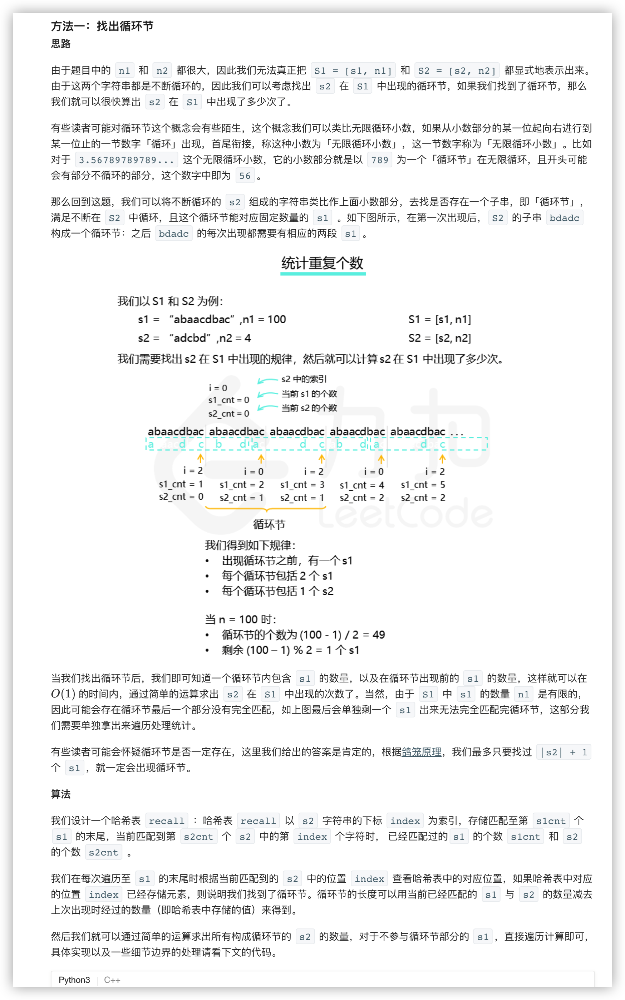

### 官方题解 [@link](https://leetcode-cn.com/problems/count-the-repetitions/solution/tong-ji-zhong-fu-ge-shu-by-leetcode-solution/)



```python
class Solution:
    def getMaxRepetitions(self, s1: str, n1: int, s2: str, n2: int) -> int:
        if n1 == 0:
            return 0
        s1cnt, index, s2cnt = 0, 0, 0
        # recall 是我们用来找循环节的变量，它是一个哈希映射
        # 我们如何找循环节？假设我们遍历了 s1cnt 个 s1，此时匹配到了第 s2cnt 个 s2 中的第 index 个字符
        # 如果我们之前遍历了 s1cnt' 个 s1 时，匹配到的是第 s2cnt' 个 s2 中同样的第 index 个字符，那么就有循环节了
        # 我们用 (s1cnt', s2cnt', index) 和 (s1cnt, s2cnt, index) 表示两次包含相同 index 的匹配结果
        # 那么哈希映射中的键就是 index，值就是 (s1cnt', s2cnt') 这个二元组
        # 循环节就是；
        #    - 前 s1cnt' 个 s1 包含了 s2cnt' 个 s2
        #    - 以后的每 (s1cnt - s1cnt') 个 s1 包含了 (s2cnt - s2cnt') 个 s2
        # 那么还会剩下 (n1 - s1cnt') % (s1cnt - s1cnt') 个 s1, 我们对这些与 s2 进行暴力匹配
        # 注意 s2 要从第 index 个字符开始匹配
        recall = dict()
        while True:
            # 我们多遍历一个 s1，看看能不能找到循环节
            s1cnt += 1
            for ch in s1:
                if ch == s2[index]:
                    index += 1
                    if index == len(s2):
                        s2cnt, index = s2cnt + 1, 0
            # 还没有找到循环节，所有的 s1 就用完了
            if s1cnt == n1:
                return s2cnt // n2
            # 出现了之前的 index，表示找到了循环节
            if index in recall:
                s1cnt_prime, s2cnt_prime = recall[index]
                # 前 s1cnt' 个 s1 包含了 s2cnt' 个 s2
                pre_loop = (s1cnt_prime, s2cnt_prime)
                # 以后的每 (s1cnt - s1cnt') 个 s1 包含了 (s2cnt - s2cnt') 个 s2
                in_loop = (s1cnt - s1cnt_prime, s2cnt - s2cnt_prime)
                break
            else:
                recall[index] = (s1cnt, s2cnt)

        # ans 存储的是 S1 包含的 s2 的数量，考虑的之前的 pre_loop 和 in_loop
        ans = pre_loop[1] + (n1 - pre_loop[0]) // in_loop[0] * in_loop[1]
        # S1 的末尾还剩下一些 s1，我们暴力进行匹配
        rest = (n1 - pre_loop[0]) % in_loop[0]
        for i in range(rest):
            for ch in s1:
                if ch == s2[index]:
                    index += 1
                    if index == len(s2):
                        ans, index = ans + 1, 0
        # S1 包含 ans 个 s2，那么就包含 ans / n2 个 S2
        return ans // n2
```


