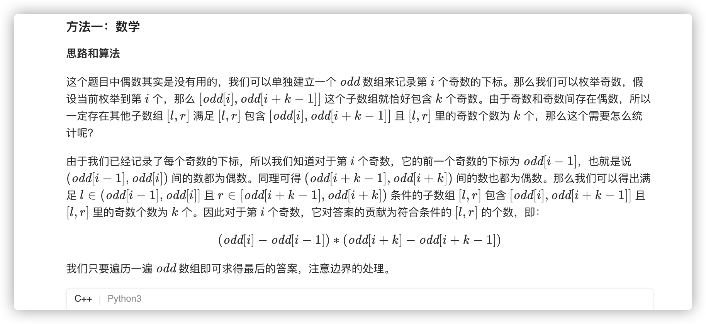
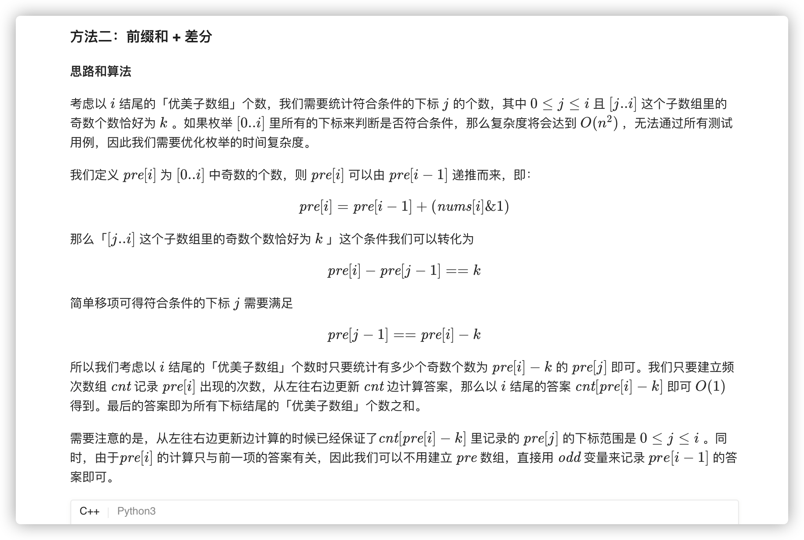
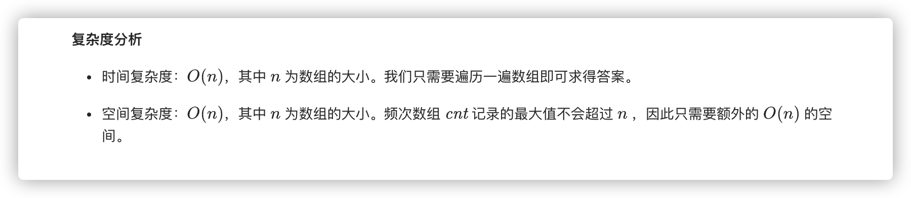

### 官方题解 [@link](https://leetcode-cn.com/problems/count-number-of-nice-subarrays/solution/tong-ji-you-mei-zi-shu-zu-by-leetcode-solution/)


```C++
class Solution {
public:
    int numberOfSubarrays(vector<int>& nums, int k) {
        int n = (int)nums.size();
        int odd[n + 2], ans = 0, cnt = 0;
        for (int i = 0; i < n; ++i) {
            if (nums[i] & 1) odd[++cnt] = i;
        }
        odd[0] = -1, odd[++cnt] = n;
        for (int i = 1; i + k <= cnt; ++i) {
            ans += (odd[i] - odd[i - 1]) * (odd[i + k] - odd[i + k - 1]); 
        }
        return ans;
    }
};
```


```C++
class Solution {
    vector<int> cnt;
public:
    int numberOfSubarrays(vector<int>& nums, int k) {
        int n = (int)nums.size();
        cnt.resize(n + 1, 0);
        int odd = 0, ans = 0;
        cnt[0] = 1;
        for (int i = 0; i < n; ++i) {
            odd += nums[i] & 1;
            ans += odd >= k ? cnt[odd - k] : 0;
            cnt[odd] += 1;
        }
        return ans;
    }
};
```



