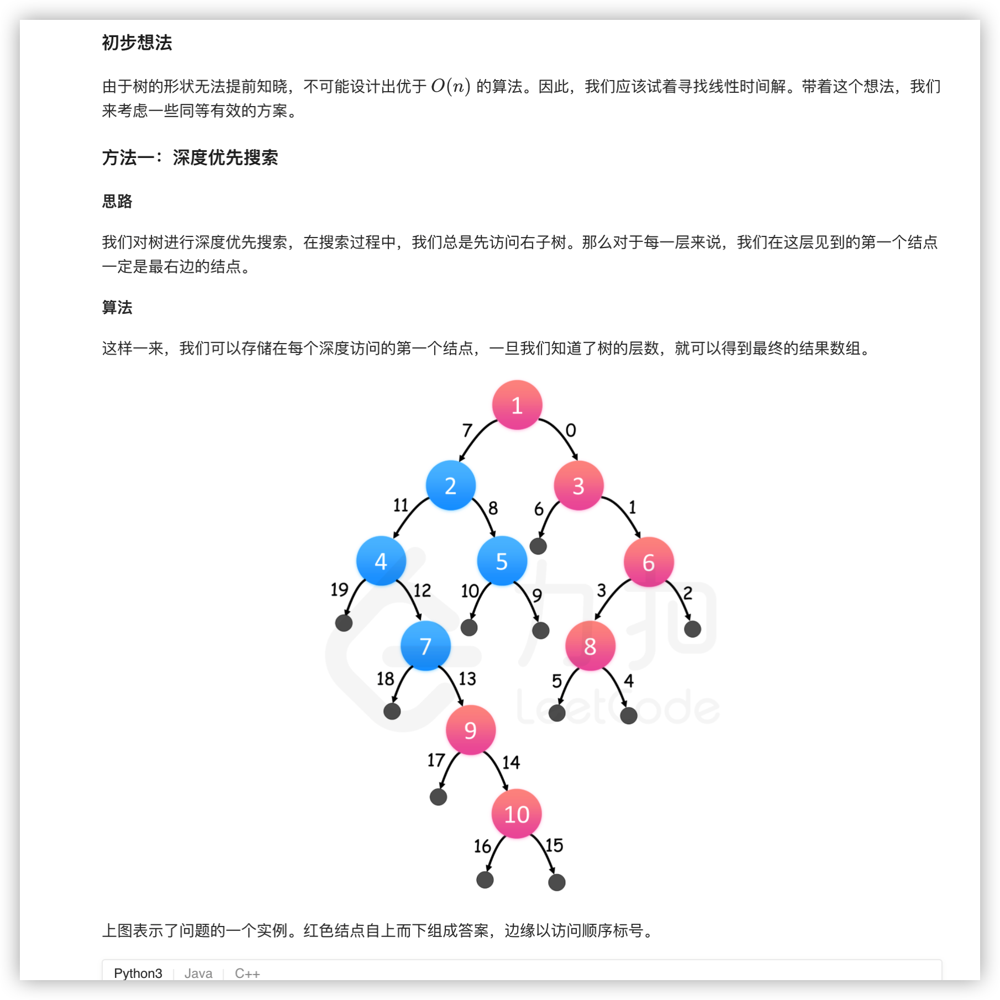
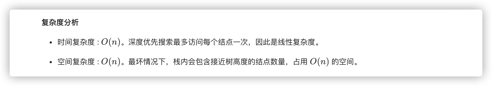
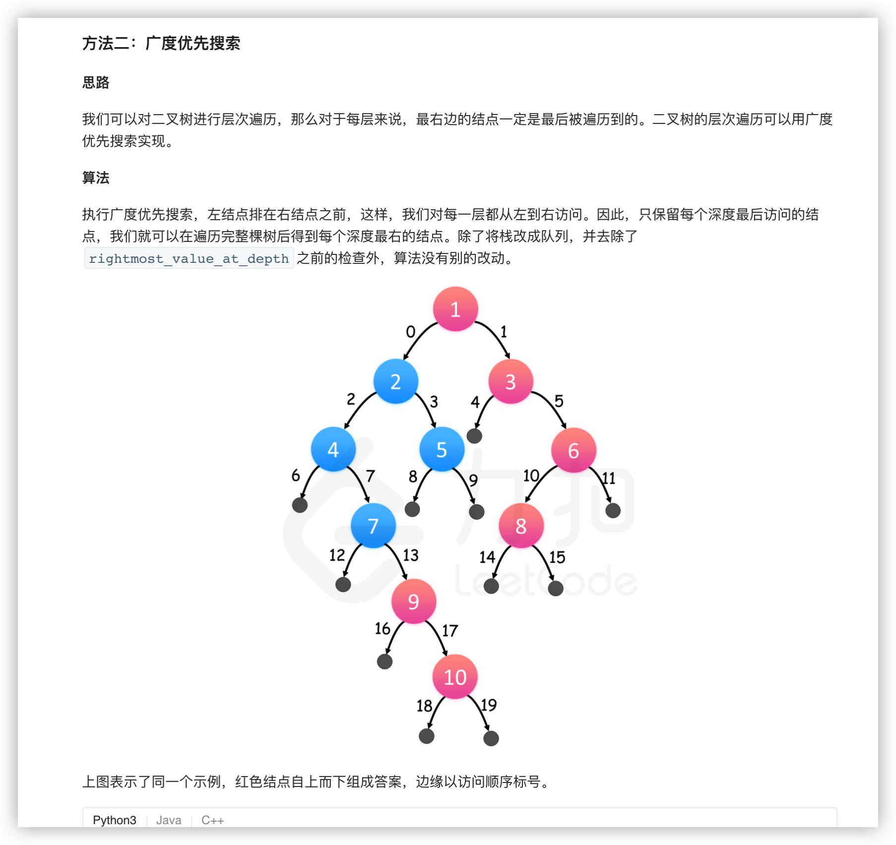
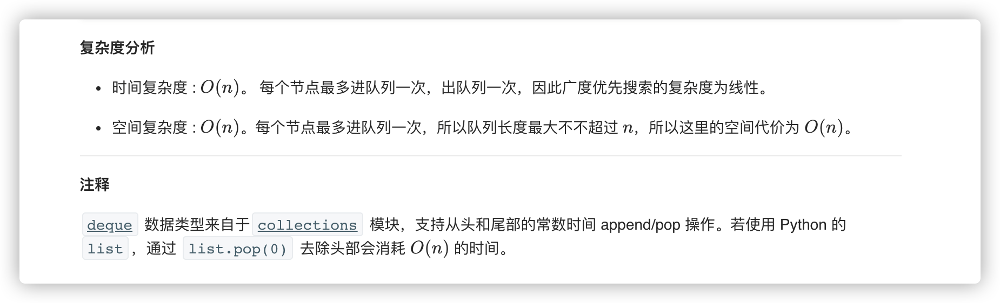

### 官方题解 [@link](https://leetcode-cn.com/problems/binary-tree-right-side-view/solution/er-cha-shu-de-you-shi-tu-by-leetcode-solution/)


```Python3
class Solution(object):
    def rightSideView(self, root):
        rightmost_value_at_depth = dict() # 深度为索引，存放节点的值
        max_depth = -1

        stack = [(root, 0)]
        while stack:
            node, depth = stack.pop()

            if node is not None:
                # 维护二叉树的最大深度
                max_depth = max(max_depth, depth)

                # 如果不存在对应深度的节点我们才插入
                rightmost_value_at_depth.setdefault(depth, node.val)

                stack.append((node.left, depth+1))
                stack.append((node.right, depth+1))

        return [rightmost_value_at_depth[depth] for depth in range(max_depth+1)]
```


```Python3
from collections import deque

class Solution(object):
    def rightSideView(self, root):
        rightmost_value_at_depth = dict() # 深度为索引，存放节点的值
        max_depth = -1

        queue = deque([(root, 0)])
        while queue:
            node, depth = queue.popleft()

            if node is not None:
                # 维护二叉树的最大深度
                max_depth = max(max_depth, depth)

                # 由于每一层最后一个访问到的节点才是我们要的答案，因此不断更新对应深度的信息即可
                rightmost_value_at_depth[depth] = node.val

                queue.append((node.left, depth+1))
                queue.append((node.right, depth+1))

        return [rightmost_value_at_depth[depth] for depth in range(max_depth+1)]
```



