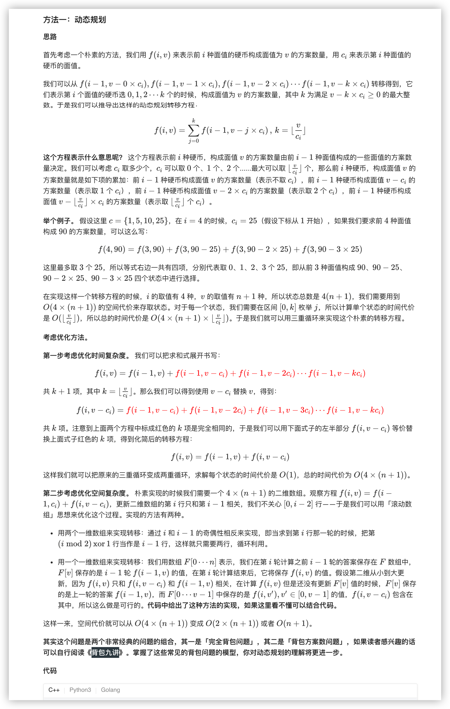
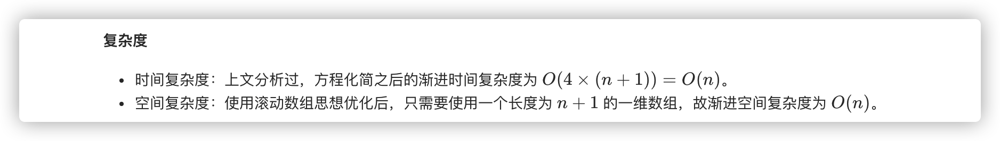
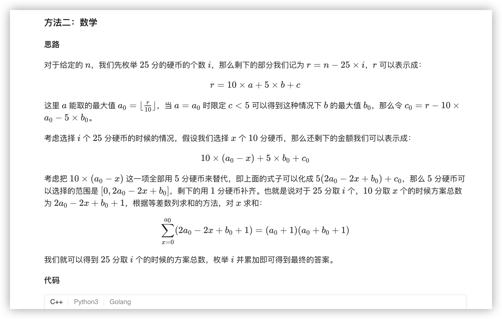
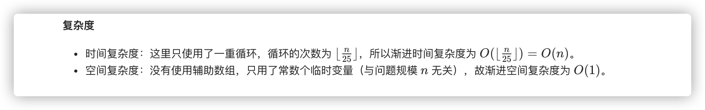

### 官方题解 [@link](https://leetcode-cn.com/problems/coin-lcci/solution/ying-bi-by-leetcode-solution/)


```C++
class Solution {
private:
    static constexpr int mod = 1000000007;
    static constexpr int coins[4] = {25, 10, 5, 1};

public:
    int waysToChange(int n) {
        vector<int> f(n + 1);
        f[0] = 1;
        for (int c = 0; c < 4; ++c) {
            int coin = coins[c];
            for (int i = coin; i <= n; ++i) {
                f[i] = (f[i] + f[i - coin]) % mod;
            }
        }
        return f[n];
    }
};
```


```C++
class Solution {
private:
    static constexpr int mod = 1000000007;

public:
    int waysToChange(int n) {
        int ans = 0;
        for (int i = 0; i * 25 <= n; ++i) {
            int rest = n - i * 25;
            int a = rest / 10;
            int b = rest % 10 / 5;
            ans = (ans + (long long)(a + 1) * (a + b + 1) % mod) % mod;
        }
        return ans;
    }
};
```



