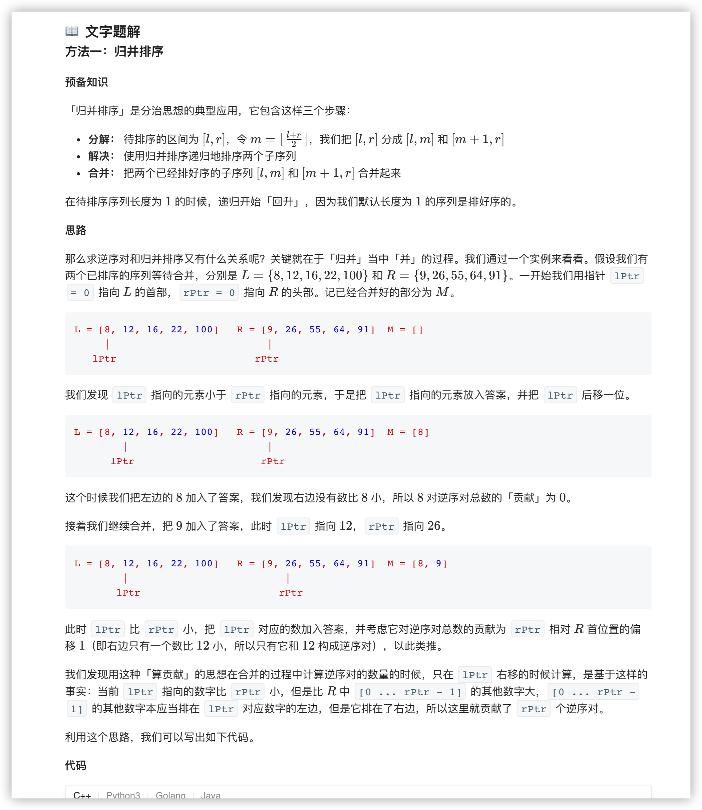
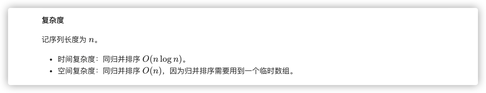
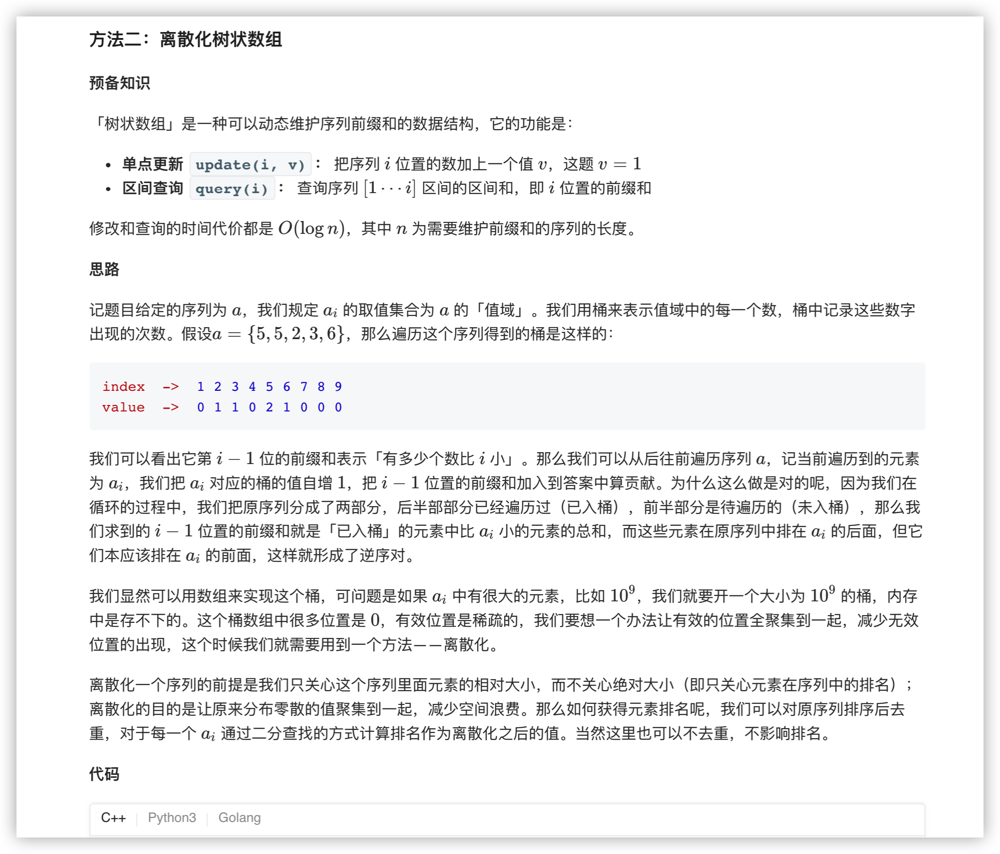
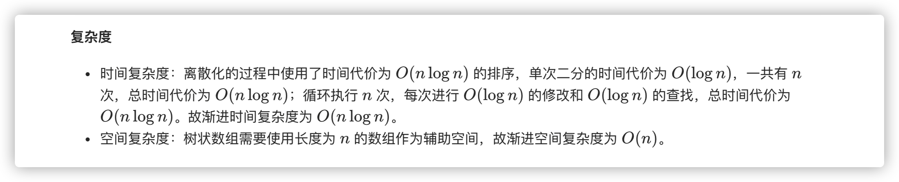

### 官方题解 [@link](https://leetcode-cn.com/problems/shu-zu-zhong-de-ni-xu-dui-lcof/solution/shu-zu-zhong-de-ni-xu-dui-by-leetcode-solution/)


```C++
class Solution {
public:
    int mergeSort(vector<int>& nums, vector<int>& tmp, int l, int r) {
        if (l >= r) {
            return 0;
        }

        int mid = (l + r) / 2;
        int inv_count = mergeSort(nums, tmp, l, mid) + mergeSort(nums, tmp, mid + 1, r);
        int i = l, j = mid + 1, pos = l;
        while (i <= mid && j <= r) {
            if (nums[i] <= nums[j]) {
                tmp[pos] = nums[i];
                ++i;
                inv_count += (j - (mid + 1));
            }
            else {
                tmp[pos] = nums[j];
                ++j;
            }
            ++pos;
        }
        for (int k = i; k <= mid; ++k) {
            tmp[pos++] = nums[k];
            inv_count += (j - (mid + 1));
        }
        for (int k = j; k <= r; ++k) {
            tmp[pos++] = nums[k];
        }
        copy(tmp.begin() + l, tmp.begin() + r + 1, nums.begin() + l);
        return inv_count;
    }

    int reversePairs(vector<int>& nums) {
        int n = nums.size();
        vector<int> tmp(n);
        return mergeSort(nums, tmp, 0, n - 1);
    }
};
```


```C++
class BIT {
private:
    vector<int> tree;
    int n;

public:
    BIT(int _n): n(_n), tree(_n + 1) {}

    static int lowbit(int x) {
        return x & (-x);
    }

    int query(int x) {
        int ret = 0;
        while (x) {
            ret += tree[x];
            x -= lowbit(x);
        }
        return ret;
    }

    void update(int x) {
        while (x <= n) {
            ++tree[x];
            x += lowbit(x);
        }
    }
};

class Solution {
public:
    int reversePairs(vector<int>& nums) {
        int n = nums.size();
        vector<int> tmp = nums;
        // 离散化
        sort(tmp.begin(), tmp.end());
        for (int& num: nums) {
            num = lower_bound(tmp.begin(), tmp.end(), num) - tmp.begin() + 1;
        }
        // 树状数组统计逆序对
        BIT bit(n);
        int ans = 0;
        for (int i = n - 1; i >= 0; --i) {
            ans += bit.query(nums[i] - 1);
            bit.update(nums[i]);
        }
        return ans;
    }
};
```



