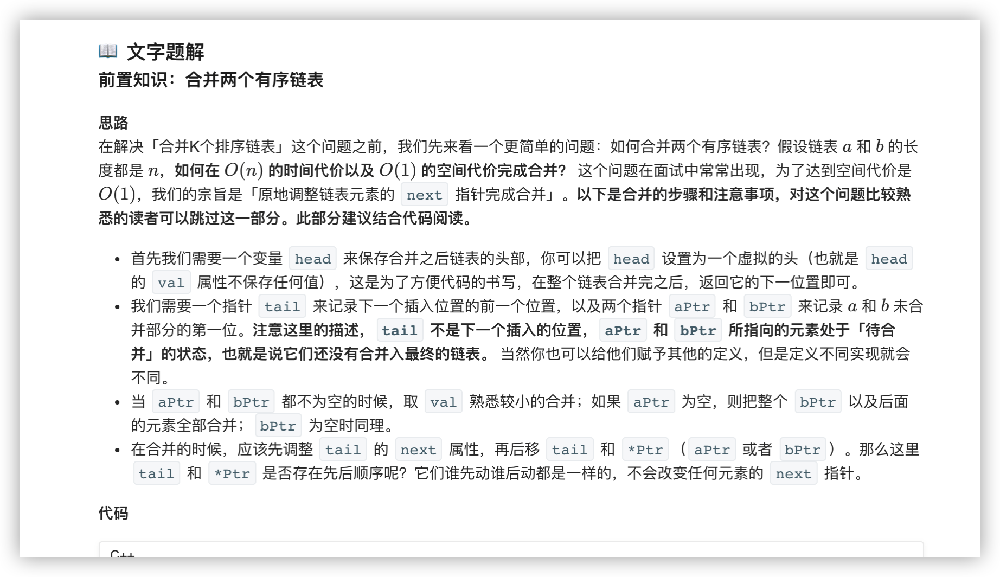
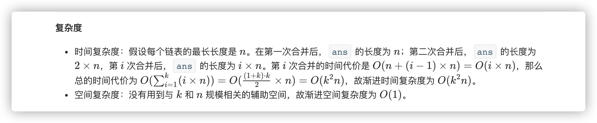
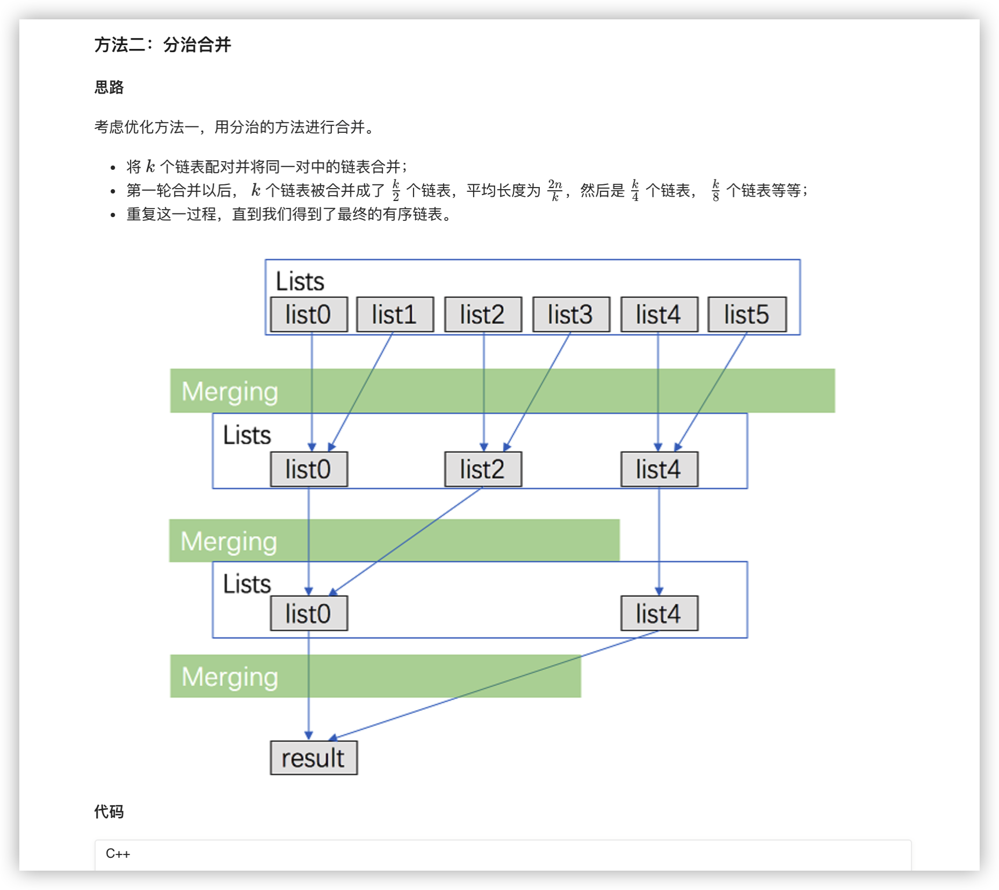
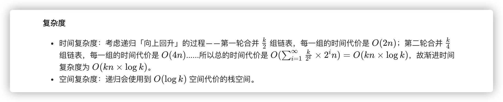
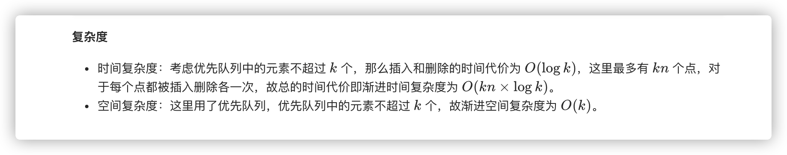

### 官方题解 [@link](https://leetcode-cn.com/problems/merge-k-sorted-lists/solution/he-bing-kge-pai-xu-lian-biao-by-leetcode-solutio-2/)


```C++
ListNode* mergeTwoLists(ListNode *a, ListNode *b) {
    if ((!a) || (!b)) return a ? a : b;
    ListNode head, *tail = &head, *aPtr = a, *bPtr = b;
    while (aPtr && bPtr) {
        if (aPtr->val < bPtr->val) {
            tail->next = aPtr; aPtr = aPtr->next;
        } else {
            tail->next = bPtr; bPtr = bPtr->next;
        }
        tail = tail->next;
    }
    tail->next = (aPtr ? aPtr : bPtr);
    return head.next;
}
```


```C++
class Solution {
public:
    ListNode* mergeTwoLists(ListNode *a, ListNode *b) {
        if ((!a) || (!b)) return a ? a : b;
        ListNode head, *tail = &head, *aPtr = a, *bPtr = b;
        while (aPtr && bPtr) {
            if (aPtr->val < bPtr->val) {
                tail->next = aPtr; aPtr = aPtr->next;
            } else {
                tail->next = bPtr; bPtr = bPtr->next;
            }
            tail = tail->next;
        }
        tail->next = (aPtr ? aPtr : bPtr);
        return head.next;
    }

    ListNode* mergeKLists(vector<ListNode*>& lists) {
        ListNode *ans = nullptr;
        for (size_t i = 0; i < lists.size(); ++i) {
            ans = mergeTwoLists(ans, lists[i]);
        }
        return ans;
    }
};
```


```C++
class Solution {
public:
    ListNode* mergeTwoLists(ListNode *a, ListNode *b) {
        if ((!a) || (!b)) return a ? a : b;
        ListNode head, *tail = &head, *aPtr = a, *bPtr = b;
        while (aPtr && bPtr) {
            if (aPtr->val < bPtr->val) {
                tail->next = aPtr; aPtr = aPtr->next;
            } else {
                tail->next = bPtr; bPtr = bPtr->next;
            }
            tail = tail->next;
        }
        tail->next = (aPtr ? aPtr : bPtr);
        return head.next;
    }

    ListNode* merge(vector <ListNode*> &lists, int l, int r) {
        if (l == r) return lists[l];
        if (l > r) return nullptr;
        int mid = (l + r) >> 1;
        return mergeTwoLists(merge(lists, l, mid), merge(lists, mid + 1, r));
    }

    ListNode* mergeKLists(vector<ListNode*>& lists) {
        return merge(lists, 0, lists.size() - 1);
    }
};
```


```C++
class Solution {
public:
    struct Status {
        int val;
        ListNode *ptr;
        bool operator < (const Status &rhs) const {
            return val > rhs.val;
        }
    };

    priority_queue <Status> q;

    ListNode* mergeKLists(vector<ListNode*>& lists) {
        for (auto node: lists) {
            if (node) q.push({node->val, node});
        }
        ListNode head, *tail = &head;
        while (!q.empty()) {
            auto f = q.top(); q.pop();
            tail->next = f.ptr; 
            tail = tail->next;
            if (f.ptr->next) q.push({f.ptr->next->val, f.ptr->next});
        }
        return head.next;
    }
};
```
