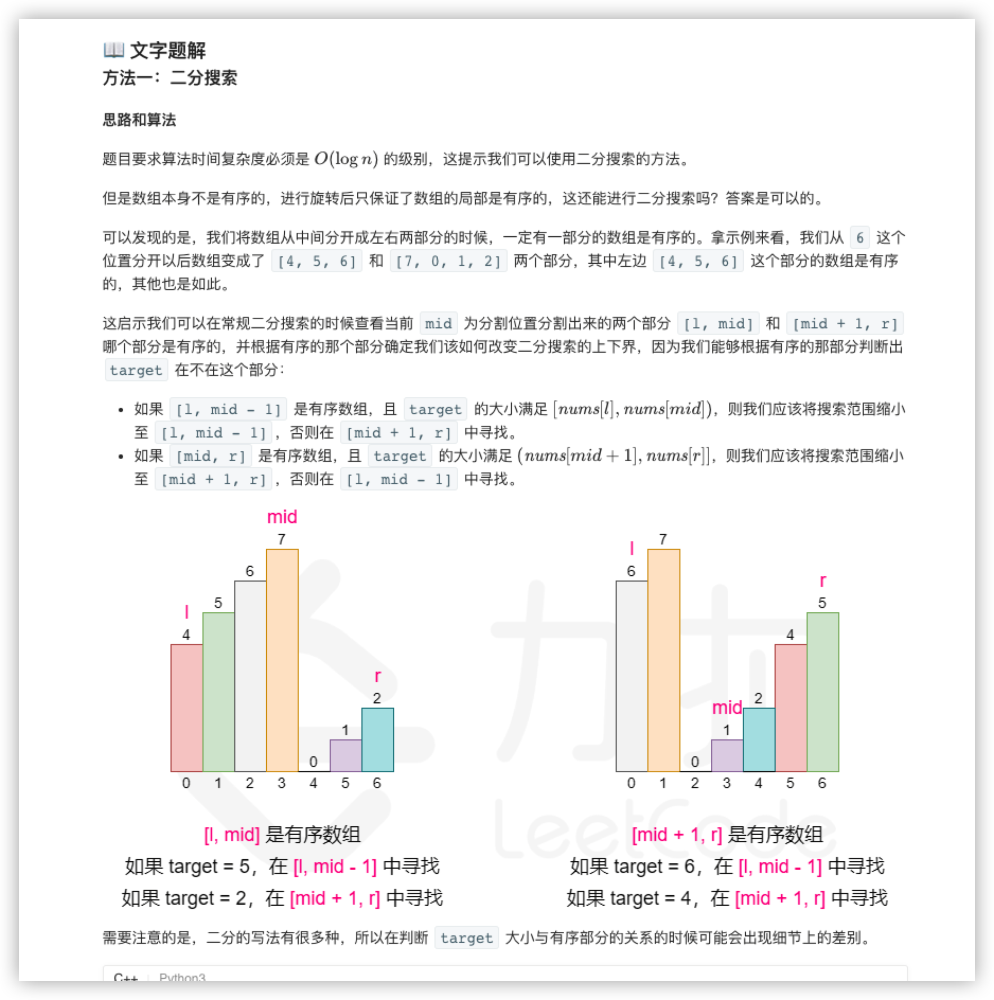
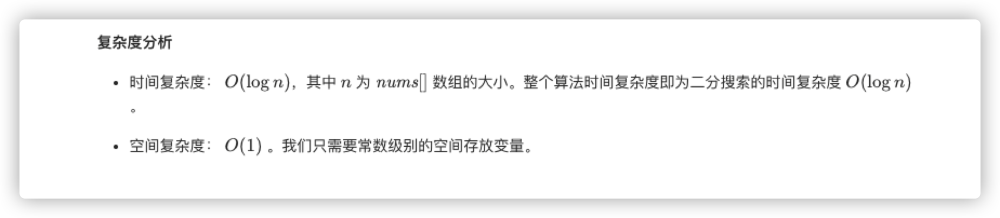

### 官方题解 [@link](https://leetcode-cn.com/problems/search-in-rotated-sorted-array/solution/sou-suo-xuan-zhuan-pai-xu-shu-zu-by-leetcode-solut/)


```C++
class Solution {
public:
    int search(vector<int>& nums, int target) {
        int n = (int)nums.size();
        if (!n) return -1;
        if (n == 1) return nums[0] == target ? 0 : -1;
        int l = 0, r = n - 1;
        while (l <= r) {
            int mid = (l + r) / 2;
            if (nums[mid] == target) return mid;
            if (nums[0] <= nums[mid]) {
                if (nums[0] <= target && target < nums[mid]) {
                    r = mid - 1;
                } else {
                    l = mid + 1;
                }
            } else {
                if (nums[mid] < target && target <= nums[n - 1]) {
                    l = mid + 1;
                } else {
                    r = mid - 1;
                }
            }
        }
        return -1;
    }
};
```
