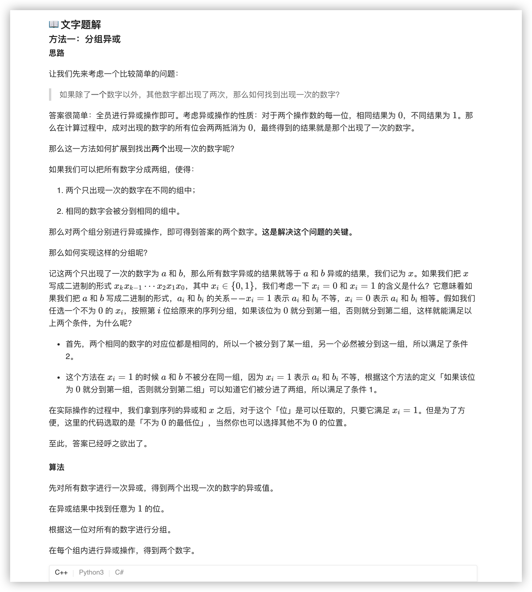
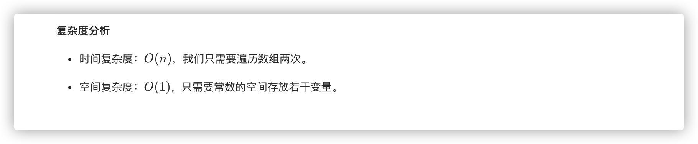

### 官方题解 [@link](https://leetcode-cn.com/problems/search-in-rotated-sorted-array/solution/sou-suo-xuan-zhuan-pai-xu-shu-zu-by-leetcode-solut/)


```C++
class Solution {
public:
    vector<int> singleNumbers(vector<int>& nums) {
        int ret = 0;
        for (int n : nums)
            ret ^= n;
        int div = 1;
        while ((div & ret) == 0)
            div <<= 1;
        int a = 0, b = 0;
        for (int n : nums)
            if (div & n)
                a ^= n;
            else
                b ^= n;
        return vector<int>{a, b};
    }
};
```
