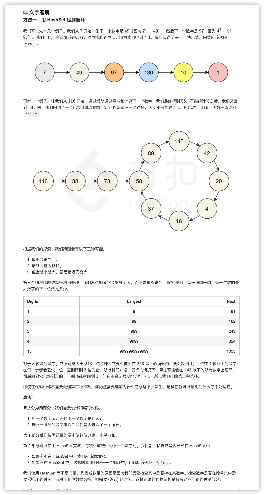
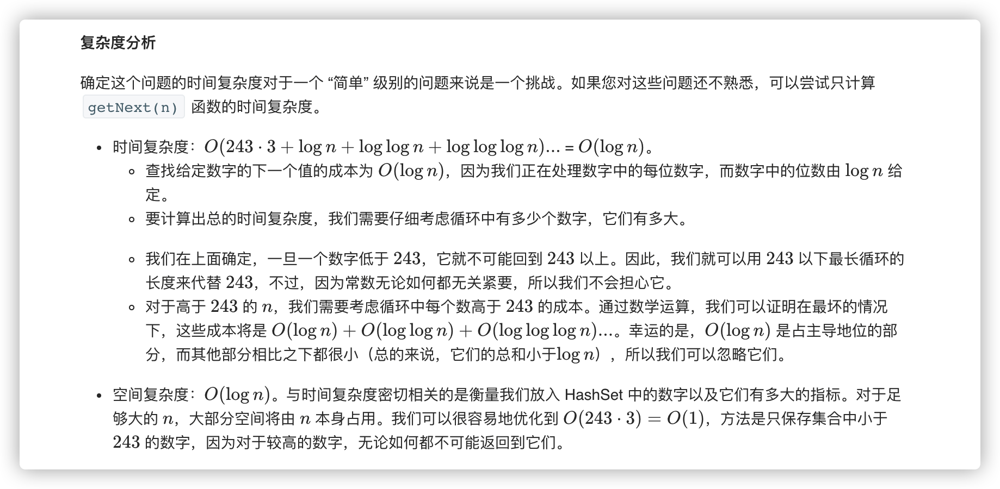
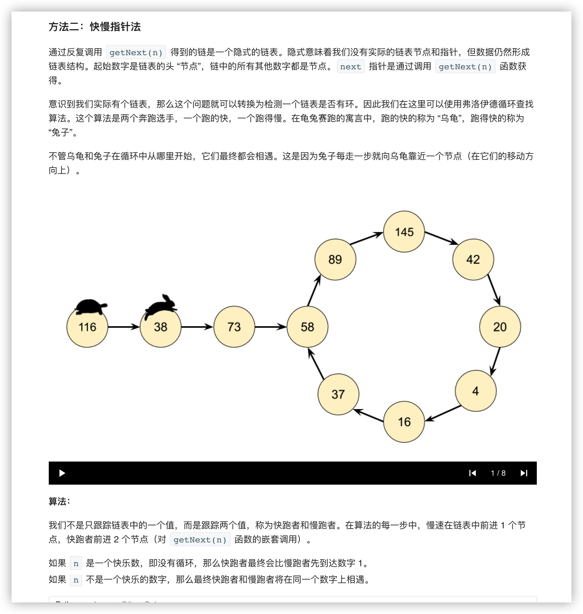
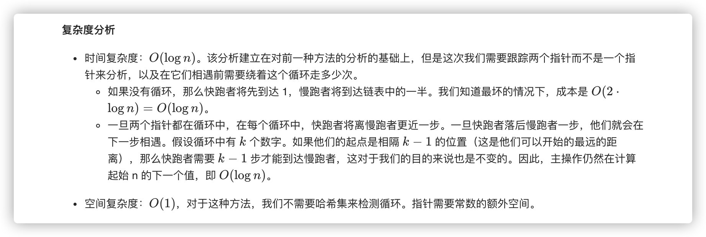

### 官方题解 [@link](https://leetcode-cn.com/problems/happy-number/solution/kuai-le-shu-by-leetcode-solution/)


```Python
def isHappy(self, n: int) -> bool:

    def get_next(n):
        total_sum = 0
        while n > 0:
            n, digit = divmod(n, 10)
            total_sum += digit ** 2
        return total_sum

    seen = set()
    while n != 1 and n not in seen:
        seen.add(n)
        n = get_next(n)

    return n == 1
```


```Python
def isHappy(self, n: int) -> bool:  
    def get_next(number):
        total_sum = 0
        while number > 0:
            number, digit = divmod(number, 10)
            total_sum += digit ** 2
        return total_sum

    slow_runner = n
    fast_runner = get_next(n)
    while fast_runner != 1 and slow_runner != fast_runner:
        slow_runner = get_next(slow_runner)
        fast_runner = get_next(get_next(fast_runner))
    return fast_runner == 1
```


```Python
def isHappy(self, n: int) -> bool:

    cycle_members = {4, 16, 37, 58, 89, 145, 42, 20}

    def get_next(number):
        total_sum = 0
        while number > 0:
            number, digit = divmod(number, 10)
            total_sum += digit ** 2
        return total_sum

    while n != 1 and n not in cycle_members:
        n = get_next(n)

    return n == 1
```
